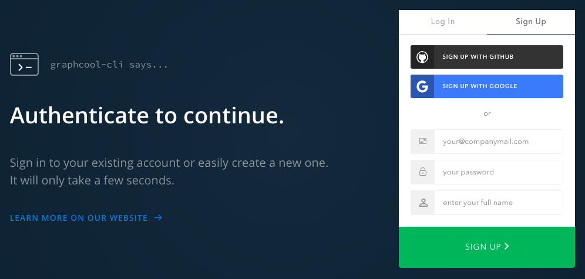
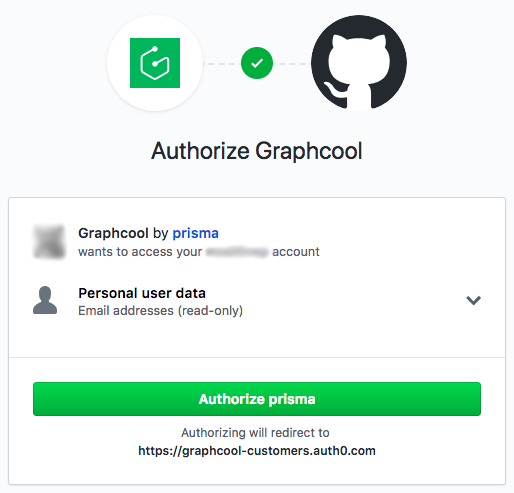

# GraphQL

> **NOTE:** for all the shell commands below, ensure that you are in the `server` directory when you run them.

## Schema

This project uses [graph.cool](https://www.graph.cool/docs/) to define and implement the GraphQL schema.

You will need to globally install the `graphcool` binary:

```
yarn global add graphcool
```

The relevant files can be found in the [`server`](./server) directory.

## Changing Graphcool deployment

You will need to change the Graphcool deployment to your own Graphcool account.

### Log in to graphcool

```sh
$ cd server
$ graphcool login
```

A web browser window will open, requesting permission to authenticate:



Sign in, or sign up with your chosen authentication method.

If you you choose GitHub, for example, you will see GitHub's **Authorize Graphcool** screen; click the **Authorize prisma** button:



Your terminal will now display a confirmation message:

```
Auth URL: https://console.graph.cool/cli/auth?cliToken=CLI_TOKEN&authTrigger=auth
Authenticating... ✔
You are already authenticated. Your local token is saved at /Users/YOUR_USERNAME/.graphcoolrc
```

### Deploy the schema

You can now deploy the schema to your own Graphcool account.

Firstly, remove the `.graphcoolrc` file:

```sh
rm .graphcoolrc
```

Then deploy the schema:

```sh
$ graphcool deploy
```

Choose `shared-eu-west-1` for the cluster, accept the default `target` and `server` names.

This will create a new `.graphcoolrc` file.

### Update the source code

You now need to point to your new Graphcool service in the source code.

Find out your server id:

```sh
$ graphcool info

Service Name Cluster / Service ID
──────────── ────────────────────────────────────────────
server       shared-eu-west-1/SERVICE_ID

API:           Endpoint:
────────────── ────────────────────────────────────────────────────────────
Simple         https://api.graph.cool/simple/v1/SERVICE_ID
Relay          https://api.graph.cool/relay/v1/SERVICE_ID
Subscriptions  wss://subscriptions.graph.cool/v1/SERVICE_ID
File           https://api.graph.cool/file/v1/SERVICE_ID
```

Now go to the `js/App.js` file, and change the value of the `serviceId` variable to match the `SERVICE_ID` in the output above.

## Seeding data

Without data, the application will not display anything, so we need to seed the Graphcool datastore with some data. Some useful starting data has already been exported for just this purpose.

### Reset existing data

If you have already done this procedure, and modified the data, you may want to reset (remove) the existing data first:

```
$ cd server
$ graphcool reset
? Are you sure that you want to reset the data of server (__GRAPHCOOL_SERVICE_ID__)? y/N (n)
```

Type `y`, and press `<Enter>`.

### Restore from previous export

You can now import the data that has been previously exported:

```sh
$ graphcool import --source export-2018-10-01T16:06:52.855Z.zip
Unzipping... 22ms
Validating data... 17ms

Uploading nodes...
Uploading nodes done 287ms

Uploading lists
Uploading lists done 211ms

Uploading relations
Uploading relations done 171ms
```

### View new data

Start the browser console:

```
$ graphcool console
```

Below **SCHEMA** near the top left, click the **DATA** button. You can now see the data stored for the schema.
